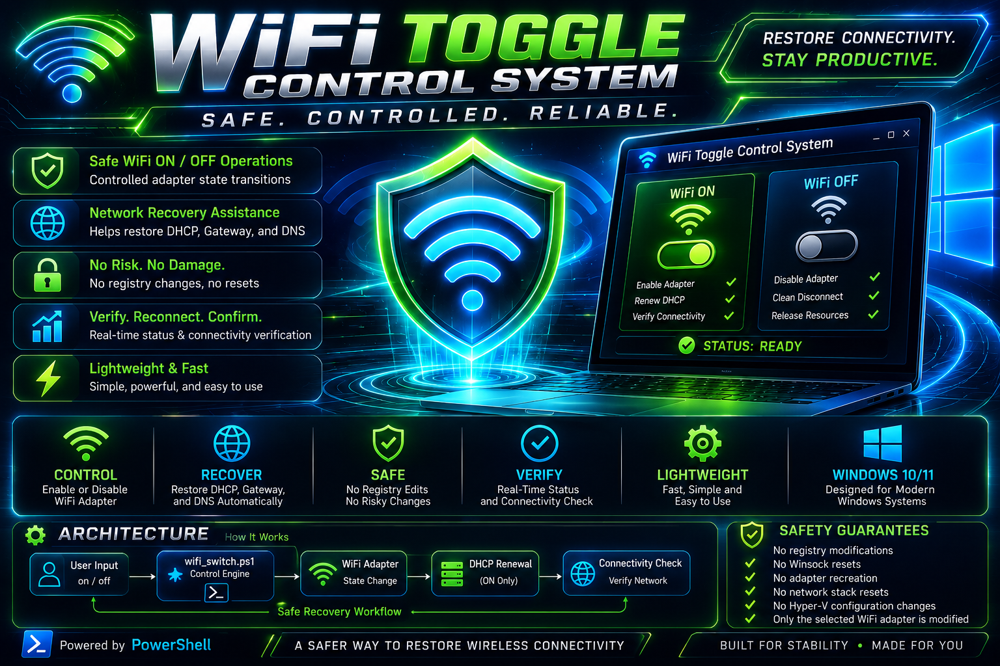
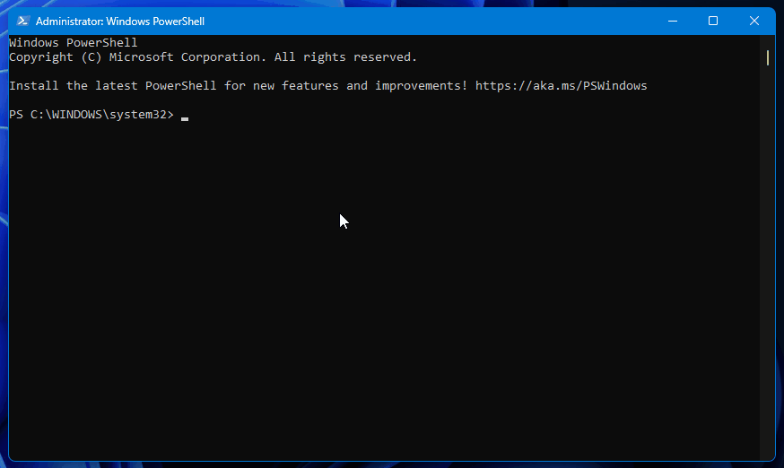
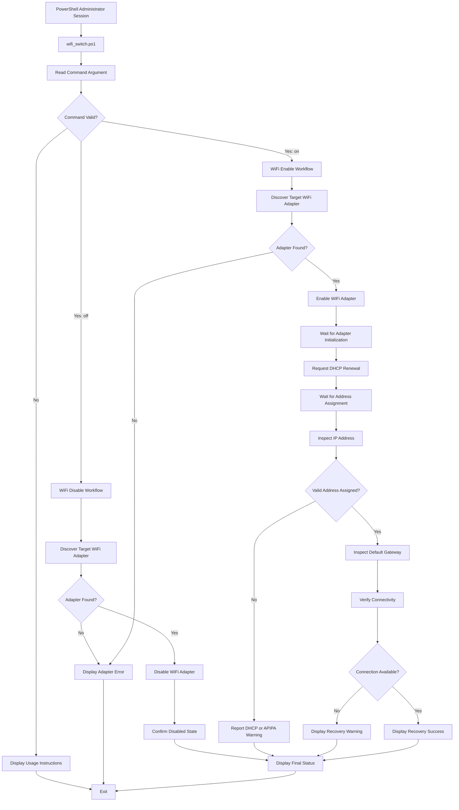

# 🔌 WiFi Toggle Control System

<p align="center">
  
</p>

<p align="center">
  
  
  
  
  
</p>

<p align="center">
  <strong>Safely disable, restore, and verify WiFi connectivity without resetting the entire Windows network stack.</strong>
</p>

---

## 🚀 Overview

**WiFi Toggle Control System** is a lightweight PowerShell network utility that performs controlled WiFi adapter shutdown and recovery operations.

It is designed for situations where Windows wireless networking becomes unstable after sleep, adapter resets, DHCP failures, virtual adapter conflicts, or failed reconnect attempts.

Instead of modifying the registry, recreating adapters, resetting Winsock, or resetting the entire network stack, the utility focuses only on the selected WiFi adapter and performs a predictable recovery sequence.

Developed by **TCDOVERLORD**.

---

## 🎬 Demo

<p align="center">
  
</p>

---

## 🧠 Why This Project Exists

Windows network problems are often addressed using aggressive repair commands that can affect unrelated adapters, VPN software, virtualization platforms, and custom network settings.

WiFi Toggle Control System takes a smaller-impact approach.

It controls the WiFi adapter directly, waits for the hardware and Windows networking services to become ready, renews DHCP configuration when WiFi is enabled, and verifies the resulting connection state.

### Common Issues Addressed

- DHCP failure states and `169.254.x.x` APIPA addresses
- Missing default gateway assignments
- DNS resolution failures
- Adapter initialization delays
- Hyper-V or VirtualBox virtual adapter conflicts
- WiFi adapter re-binding problems
- Failed reconnect states after sleep
- Failed reconnect states after adapter resets
- Stuck wireless adapter states

---

## ✨ Features

### 🔌 WiFi Control Engine

- Safe WiFi ON and OFF commands
- Controlled adapter enable and disable operations
- Clean adapter state transitions
- Adapter discovery and selection
- Predictable command-line workflow

### 🌐 Network Recovery Assistance

- Waits for adapter readiness
- Allows Windows time to reinitialize the adapter
- Renews DHCP configuration during WiFi recovery
- Helps avoid APIPA fallback addresses
- Restores routing after reconnect
- Verifies the resulting connection state

### 🛡️ Safe Execution Design

- No registry modifications
- No Winsock reset
- No adapter removal or recreation
- No full network-stack reset
- No Hyper-V configuration changes
- No VirtualBox configuration changes
- No permanent system modifications

### 📊 Verification and Feedback

- Real-time PowerShell console feedback
- Clear operation status messages
- Adapter state reporting
- Connectivity verification
- Simple success and failure flow

---

# 🏗️ Architecture

WiFi Toggle Control System uses a small, command-driven architecture that separates user input, adapter control, recovery operations, and connectivity verification.



## Architecture Layers

| Layer | Responsibility |
|---|---|
| **Command Interface** | Accepts the `on` or `off` argument and validates the requested operation. |
| **Adapter Discovery** | Locates the intended WiFi network adapter before making changes. |
| **Control Engine** | Enables or disables the selected adapter. |
| **Readiness Wait** | Gives Windows and the WiFi hardware time to complete initialization. |
| **DHCP Recovery** | Requests updated network configuration after the adapter is enabled. |
| **Network Validation** | Inspects IP addressing, gateway availability, and connectivity. |
| **Status Reporting** | Displays clear success, warning, or failure information. |

---

## 🔄 Operational Workflow

### WiFi OFF

```text
Receive OFF Command
        |
        v
Locate WiFi Adapter
        |
        v
Disable Adapter
        |
        v
Confirm Adapter State
        |
        v
Display Result
```

### WiFi ON

```text
Receive ON Command
        |
        v
Locate WiFi Adapter
        |
        v
Enable Adapter
        |
        v
Wait for Initialization
        |
        v
Renew DHCP
        |
        v
Check IP and Gateway
        |
        v
Verify Connectivity
        |
        v
Display Result
```

---

## 💻 Requirements

- Windows 10 or Windows 11
- PowerShell 5.1 or newer
- Administrator privileges
- A Windows-recognized WiFi network adapter

---

## 📥 Installation

### Clone the Repository

```powershell
git clone https://github.com/tcdoverlord/WiFi-Toggle-Control-System.git
cd WiFi-Toggle-Control-System
```

### Manual Setup

Create a working directory:

```text
C:\Update Code
```

Place the PowerShell script inside that folder:

```text
C:\Update Code\wifi_switch.ps1
```

---

## 🚀 Usage

Open **PowerShell as Administrator** and navigate to the script directory:

```powershell
cd "C:\Update Code"
```

### Disable WiFi

```powershell
.\wifi_switch.ps1 off
```

Typical uses include:

- Resetting a stuck WiFi adapter
- Clearing a failed connection state
- Temporarily disabling wireless access
- Troubleshooting DHCP problems
- Testing network recovery behavior

### Enable WiFi

```powershell
.\wifi_switch.ps1 on
```

The recovery workflow can:

1. Enable the selected WiFi adapter.
2. Wait for adapter initialization.
3. Request updated DHCP configuration.
4. Inspect the assigned network address.
5. Verify gateway and connectivity state.
6. Report the result.

---

## 📁 Project Structure

```text
WiFi-Toggle-Control-System/
|
|-- images/
|   `-- WiFi-Toggle-Control-System_Hero.png
|
|-- LICENSE
|-- README.md
|-- wifi-toggle-control-system-demo.gif
`-- wifi_switch.ps1
```

---

## 📸 Repository Images

The README expects the hero image at:

```text
images/WiFi-Toggle-Control-System_Hero.png
```

Recommended future image structure:

```text
images/
|-- WiFi-Toggle-Control-System_Hero.png
|-- WiFi-Toggle-Control-System_Architecture.png
|-- WiFi-Toggle-Control-System_Disable.png
|-- WiFi-Toggle-Control-System_Enable.png
`-- WiFi-Toggle-Control-System_Success.png
```

---

## 🛡️ Safety Model

WiFi Toggle Control System is intentionally limited in scope.

It operates on the selected WiFi adapter rather than applying broad system-wide networking changes.

### Actions the Utility Avoids

- Registry editing
- Network adapter deletion
- Device-driver removal
- Winsock reset
- TCP/IP stack reset
- Hyper-V virtual-switch changes
- VirtualBox network changes
- VPN configuration changes

### Important Notes

- Administrator privileges are required.
- Custom adapter names may require minor script adjustments.
- VPN software can temporarily affect connectivity verification.
- Virtual adapters may appear in network listings but should not be selected as the WiFi target.
- The utility does not guarantee recovery from hardware failure, driver corruption, router failure, or ISP outages.

---

## 🎯 Project Goals

This project was created as a safer alternative to repair processes that rely on:

- Full network resets
- Registry modifications
- Adapter removal and recreation
- Broad system networking changes
- Unnecessary virtualization changes

> **Restore wireless connectivity safely, predictably, and with the smallest possible impact on the operating system.**

---

## 🗺️ Roadmap

Potential future improvements include:

- Automatic WiFi adapter selection
- Configurable adapter name
- Interactive menu mode
- Connectivity retry settings
- Gateway verification
- DNS resolution checks
- Structured log files
- HTML diagnostic reports
- Desktop notifications
- Optional scheduled recovery
- Packaged launcher
- Signed PowerShell release

---

## 🤝 Contributing

Contributions, bug reports, test results, and documentation improvements are welcome.

Changes should preserve the project's minimal-impact safety model. Features that introduce registry changes, broad network resets, adapter recreation, or virtualization configuration changes should be clearly separated and documented before inclusion.

---

📄 License

This project is licensed under the **TCDOVERLORD Personal Learning License (TPLL) v1.0**.

This project is intended to support:

- 📚 Personal learning
- 🎓 Educational use
- 🧪 Research and experimentation
- 💻 Private, non-commercial projects

You are welcome to study, modify, and experiment with the source code for your own personal or educational purposes.

Commercial use—including resale, redistribution, business integration, SaaS offerings, consulting use, enterprise deployment, or inclusion in commercial products—is **not permitted** without prior written permission from the copyright owner.

For commercial licensing inquiries, please contact:

**TCDOVERLORD**

GitHub: https://github.com/tcdoverlord

See the [LICENSE](LICENSE) file for the complete license terms.

---

## 👨‍💻 Author

**TCDOVERLORD**

GitHub: [github.com/tcdoverlord](https://github.com/tcdoverlord)

Building practical Windows tools that automate repetitive work, improve reliability, and make technical recovery workflows easier to understand.

---

<p align="center">
  <strong>If I have to do it twice... I build a system.</strong>
</p>

<p align="center">
  ⭐ Star the repository if WiFi Toggle Control System helps restore your connection.
</p>
